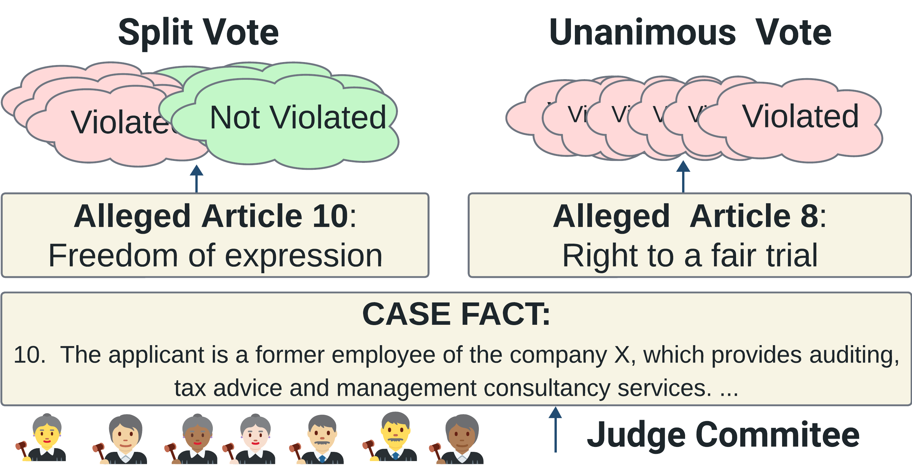

# SplitVote_ECHR
-----

Our dataset is available on Huggingface 🤗:
[https://huggingface.co/datasets/sxu/SV-ECHR)](https://huggingface.co/datasets/sxu/VECHR](https://huggingface.co/datasets/sxu/SV-ECHR))

### Dataset Summary
[Through the Lens of Split Vote: Exploring Disagreement, Difficulty and
Calibration in Legal Case Outcome Classification](https://arxiv.org/abs/2402.07214)

Recognizing vulnerability is crucial for understanding and implementing targeted support to empower individuals in need. This is especially important at the European Court of Human Rights (ECtHR), where the court adapts Convention standards to meet actual individual needs and thus to ensure effective human rights protection. However, the concept of vulnerability remains elusive at the ECtHR and no prior NLP research has dealt with it. To enable future research in this area, we present VECHR, a novel expert-annotated multi-label dataset comprising of vulnerability type classification and explanation rationale. We benchmark the performance of state-of-the-art models on VECHR from both prediction and explainability perspective. Our results demonstrate the challenging nature of task with lower prediction performance and limited agreement between models and experts. Further, we analyze the robustness of these models in dealing with out-of-domain (OOD) data and observe overall limited performance. Our dataset poses unique challenges offering a significant room for improvement regarding performance, explainability and robustness.

### Languages
English

# Citation Information
@article{xu2024through,
  title={Through the Lens of Split Vote: Exploring Disagreement, Difficulty and Calibration in Legal Case Outcome Classification},
  author={Xu, Shanshan and Santosh, TYS and Ichim, Oana and Plank, Barbara and Grabmair, Matthias},
  journal={arXiv preprint arXiv:2402.07214},
  year={2024}
}

